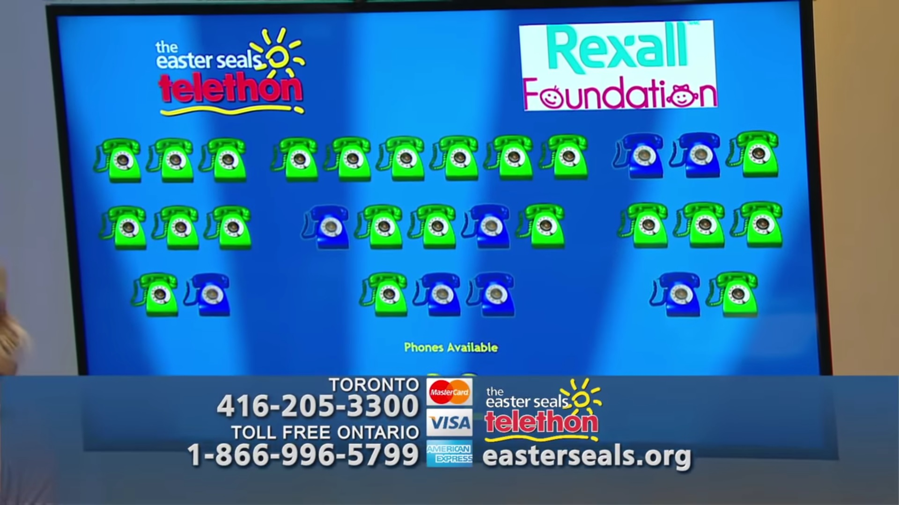

# CBC Easter Seals Phone Board

Source code for the Easter Seals Telethon Phone Board. This Windows Forms app displays VoIP phones are picked up or put down. The Easter Seals telethon is an annual charity event which is dedicated to raising awareness and funds for kids with physical disabilities.



## Operating Instructions

Running the program with a fresh build:

1. Connect an ethernet cable to the switch port that is monitoring the server port on the switch. Switched Port Analyzer (SPAN) can be used to monitor a server port on a Cisco Switch.
2. Create a text file called address.txt in the root directory (same directory as the CBCEasterSeals.exe file). If you run the program without address.txt, the file will be generated and the program will close. Here is an example of the address.txt contents:
```
#MAC address and ip address of each phone
C47295A8773C,192.168.1.2
C47295A8797C,192.168.1.3
C47295A874FF,192.168.1.4
```
or
```
#Just MAC address
C47295A8773C,
C47295A8797C,
C47295A874FF,
```

Please Note:
* Each line represents a phone and the order in which they should ring.
* The first identifier is the MAC address of the phone. It is **required**. The second identifier after the comma is the IP address and it is optional.
* **Ending comma after the MAC address is required**
* Using IP address is not recommended since it often changes due to DHCP.
* Maximum number of phones is 30 and the layout of the phones is based on the Easter Seals Telethon Toronto setup.
* A comment can be written by puttign a # before your comment text

3. After configuring address.txt, restart the program. 
4. Select the network adapter that is connected to the switch and hit ok, you should now see the visual representation of the phones on the main screen.
5. You can  update address.txt during runtime. To do so, write down your changes and save the file. Then in the control panel, click the "Reload Images update address.txt"  button to apply changes.

### Using the Control Panel

By double clicking on the labels on the top part of the control panel, you can manually trigger the phones to go on or off hook.
Using ON/OFF buttons you can manually turn all phones on or off the hook at once
Using the Phone Identification Method radio buttons, you can change the phone detection method.
If a phone is replaced during the show, address.txt can be updated and applied using the "Reload Images/update address.txt" button


### Setting Sponsors

To display a sponsor image on the main screen:

1. Find or create a Sponsors folder in the root directory.
2. Add sponsor images to the Sponsors folder.
3. Using the control panel you can preview, hide, or set the sponsor image. Alternatively you can show the Easter Seals logo.

### Logging

After exiting the application gracefully a log file will be generated in the logs folder. The logs show when and which phone was picked up and put down.

A summaryLog_\{CurrentDateTime\}.txt will also be generated containing a report of call data.

## Original README Contents

Title: CBC Easter Seals Telethon Telephone Monitoring System
Author: Willem Hinzmann (whinzmann@gmail.com)
Copyright notice:
All code contained in this project was written by Willem Hinzmann unless otherwise specified below.
The author retains sole ownership of this code and grants licence for its use and modification only
for academic or charitable work. No commercial use of this code (compiled or un-compiled) is
authorized unless explicitly granted by the author. This code is provided as-is and the author
assumes no liability or risk for its functioning. Any and all liability and risk rests with the end
user(s).

All logos are property of their respective owners. LabJack driver is property of LabJack Corporation.
C# and Visual Studio are property of Microsoft Corporation. Code contained in files with the
extension ".Designer.cs" was generated using Visual Studio's designer interface.

The images "on.png" and "off.png" were created and are owned by Sarah Shestowsky
(sarah.shestowsky@gmail.com). Their use is authorized only for the CBC Easter Seals Telethon.

The author acknowledges Ken Wong's work as an initial reference for writing the LabJackController class.

To the best of the author's knowledge no additional sources have been omitted.

Any distribution of this code (whole or partial) must be accompanied by this notice.